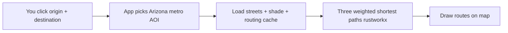

# UmbraStride

**Walk in more shade when you want to** — shadow-oriented pedestrian routing for Arizona, inspired by [*Walking in the Shade*](https://doi.org/10.1145/3678717.3691287) (Feng et al., SIGSPATIAL 2024).

UmbraStride builds walkable street networks from [OpenStreetMap](https://www.openstreetmap.org/), estimates how shady each street is at a chosen time, and finds routes that balance **staying cool (shadier)** vs **walking less (shorter)**. You use a map in the browser: click start and end, move a slider, get up to three colored paths.

---

## Who is this for?

| You are… | Start here |
|-----------|------------|
| **Using the map** (no coding) | [docs/user-guide.md](docs/user-guide.md) |
| **Installing on your laptop** | [docs/setup.md](docs/setup.md) |
| **Making routing fast** | [docs/performance.md](docs/performance.md) |
| **Fixing errors** | [docs/troubleshooting.md](docs/troubleshooting.md) |
| **Developing / integrating** | [docs/architecture.md](docs/architecture.md) + [docs/api.md](docs/api.md) |
| **Unsure of a term** | [docs/glossary.md](docs/glossary.md) |

**Full documentation index:** [docs/README.md](docs/README.md)

---

## What you get in the app

- **Shortest route** (orange) — fewest meters; shade ignored.
- **Coolest route** (teal) — prefers shadier street segments; may be longer.
- **Your route** (purple) — based on the **shade ↔ short** slider.
- **3D buildings** ([OpenFreeMap](https://openfreemap.org/) + [MapLibre 3D example](https://maplibre.org/maplibre-gl-js/docs/examples/display-buildings-in-3d/)).
- **Live building shadows** (optional) with a [ShadeMap](https://shademap.app/about/) API key.
- **Automatic area selection** — no city dropdown; picks the right Arizona metro from map clicks.

**Default coverage:** [Phoenix metro (wide)](docs/arizona.md) — `az-phoenix`. Smaller downtown graph: `az-phoenix-core`.

---

## How it works (short version)



Shade data: SQLite on disk. Routing uses **pickle graph load**, **disk routing cache**, and **rustworkx** for fast paths. See [Routing performance](docs/performance.md).

---

## Quick start (technical)

**Prerequisites:** Python 3.11+, Node.js 20+, ~2 GB disk for Phoenix metro.

**Full steps:** [docs/setup.md](docs/setup.md)

### 1. Clone and configure

```bash
git clone https://github.com/HastiPatel05/UmbraStride.git
cd UmbraStride
cp .env.example .env
cp apps/web/.env.example apps/web/.env
```

### 2. Install dependencies

```bash
python3 -m venv .venv && source .venv/bin/activate
pip install -e "packages/geo-core[dev]" -e "packages/routing-core[dev]" -e "services/api[dev]"
npm install
```

### 3. Download streets + shade

```bash
python scripts/bootstrap_arizona.py --preset az-phoenix
python scripts/seed_demo_cache.py --aoi az-phoenix --hours 10,11,12,13,14 --date 2026-05-22
```

### 4. Run

**Terminal 1 — API** (warms cache on startup if configured in `.env`):

```bash
uvicorn umbrastride_api.main:app --reload --host 127.0.0.1 --port 8000
```

**Terminal 2 — Web:**

```bash
npm run dev:web
```

Open **http://localhost:5173** — [User walkthrough](docs/user-guide.md)

**Optional — warm routing before demo:**

```bash
curl -X POST http://127.0.0.1:8000/v1/aoi/az-phoenix/routing/warm \
  -H "Content-Type: application/json" \
  -d '{"hours": [10, 11, 12, 13, 14]}'
```

---

## Project structure

| Path | Role |
|------|------|
| `apps/web` | React + MapLibre UI |
| `services/api` | FastAPI (`/v1/route`, warm endpoints) |
| `services/shade-worker` | Optional ShadeMap profiling |
| `packages/geo-core` | OSM graph ingest, pickle, edge index |
| `packages/routing-core` | rustworkx routing, shade store, disk cache |
| `scripts/` | Bootstrap, seed, precompute |
| `data/` | Graphs, shade cache, routing cache |
| `docs/` | Documentation |

---

## Documentation

| Document | Contents |
|----------|----------|
| [docs/README.md](docs/README.md) | **Documentation hub** |
| [docs/setup.md](docs/setup.md) | Install, bootstrap, run (all platforms) |
| [docs/performance.md](docs/performance.md) | **Caches, warm, fast routing** |
| [docs/user-guide.md](docs/user-guide.md) | Using the map |
| [docs/troubleshooting.md](docs/troubleshooting.md) | Common problems |
| [docs/glossary.md](docs/glossary.md) | Terms (AOI, alpha, …) |
| [docs/configuration.md](docs/configuration.md) | All `.env` variables |
| [docs/arizona.md](docs/arizona.md) | Metro presets |
| [docs/shade-cache.md](docs/shade-cache.md) | Shade storage |
| [docs/api.md](docs/api.md) | HTTP API reference |
| [docs/architecture.md](docs/architecture.md) | System design |

---

## Environment variables (minimum)

```env
# .env
DATA_DIR=./data
DEFAULT_AOI_ID=az-phoenix
ROUTING_WARM_ON_STARTUP=1
ROUTING_WARM_HOURS=10,11,12,13,14

# apps/web/.env
VITE_DEFAULT_AOI=az-phoenix
```

See [docs/configuration.md](docs/configuration.md).

---

## Scripts cheat sheet

| Command | Purpose |
|---------|---------|
| `python scripts/bootstrap_arizona.py --preset az-phoenix` | Download walk streets |
| `python scripts/seed_demo_cache.py --aoi az-phoenix --hours 10,11,12,13,14` | Synthetic shade |
| `POST /v1/aoi/az-phoenix/routing/warm` | Preload routing cache |
| `npm run dev:web` | Web :5173 |

---

## License and attribution

- **Code:** MIT — [LICENSE](LICENSE)
- **Research:** Yu Feng et al., SIGSPATIAL 2024 — [doi.org/10.1145/3678717.3691287](https://doi.org/10.1145/3678717.3691287)
- **Shadows:** [ShadeMap](https://shademap.app/)
- **Streets:** [OpenStreetMap](https://www.openstreetmap.org/) via [OSMnx](https://osmnx.readthedocs.io/)
- **Basemap / 3D:** [OpenFreeMap](https://openfreemap.org/)
