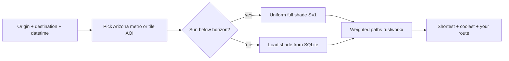

# UmbraStride

Copyright (c) 2026 Tanmay Godse and Hasti Pareshbhai Patel. All Rights Reserved.

**Walk in more shade when you want to** — shadow-oriented pedestrian routing for Arizona, inspired by [*Walking in the Shade*](https://doi.org/10.1145/3678717.3691287) (Feng et al., SIGSPATIAL 2024).

UmbraStride builds walkable street networks from [OpenStreetMap](https://www.openstreetmap.org/), estimates how shady each street is at a chosen time, and finds routes that balance **staying cool (shadier)** vs **walking less (shorter)**. You use a map in the browser: click start and end, move a slider, get up to three colored paths.

---

## Vercel Hobby demo branch

This branch, `vercel-deploy`, is intentionally **not the full Arizona deployment**.
It exists so the project can run on **Vercel Hobby** as a small, live demo:

- **Frontend:** Vite app served by Vercel.
- **API:** Minimal same-origin FastAPI function in [`api/index.py`](api/index.py), exposed under `/api`.
- **Runtime data:** Compact [`data-vercel/`](data-vercel/) artifacts only.
- **Demo AOI:** `az-phoenix-vercel`.
- **Bounding box:** `[-112.09, 33.465, -112.045, 33.505]`.

The map shows this demo area with an outlined box and blocks clicks outside it. The API also rejects route requests whose origin or destination falls outside that box. This is deliberate: Vercel Hobby is serverless and has fixed limits on bundle size, memory, duration, response payloads, and writable filesystem behavior. The full UmbraStride stack needs long-running services, precomputed graph/shade/routing data, and a persistent `data/` volume; that belongs on the normal deployment path, not this branch.

For full Phoenix, statewide Arizona tiles, Docker Compose, shade-worker, bootstrap jobs, and persistent cache deployment, use the **`main` branch** and the full docs:

- [docs/setup.md](docs/setup.md)
- [docs/arizona.md](docs/arizona.md)
- [docs/docker.md](docs/docker.md)
- [docs/performance.md](docs/performance.md)

Do not remove the bbox guard from this branch unless the Vercel runtime data is also expanded and the deployment target can handle the extra compute and storage.

---

## Who is this for?

| You are… | Start here |
|-----------|------------|
| **Using the map** (no coding) | [docs/user-guide.md](docs/user-guide.md) |
| **Installing on your laptop** | [docs/setup.md](docs/setup.md) |
| **Making routing fast** | [docs/performance.md](docs/performance.md) |
| **Fixing errors** | [docs/troubleshooting.md](docs/troubleshooting.md) |
| **Developing / integrating** | [docs/architecture.md](docs/architecture.md) + [docs/api.md](docs/api.md) |
| **Unsure of a term** | [docs/glossary.md](docs/glossary.md) |

**Full documentation index:** [docs/README.md](docs/README.md)

---

## What you get in the app

- **Shortest route** (orange) — fewest meters; shade ignored.
- **Coolest route** (teal) — prefers shadier street segments; may be longer. **At night** (sun down at both ends), same path as shortest.
- **Your route** (purple) — based on the **shade ↔ short** slider.
- **3D buildings** ([OpenFreeMap](https://openfreemap.org/) + [MapLibre 3D example](https://maplibre.org/maplibre-gl-js/docs/examples/display-buildings-in-3d/)).
- **Live building shadows** from local SunCalc + building footprints (no ShadeMap API key).
- **Automatic area selection** — no city dropdown; picks the right Arizona metro or same-tile AOI from map clicks.
- **Night-aware routing** — when the sun is below the horizon at both ends, coolest and shortest use the **same path** (uniform full shade).

**Default coverage:** [Phoenix metro (wide)](docs/arizona.md) — `az-phoenix`. Smaller downtown graph: `az-phoenix-core`. Rural Arizona can be prepared on demand with `az-tile-*` grid AOIs.

---

## How it works (short version)



| Piece | Role |
|-------|------|
| **Shade cache** | SQLite — shade per street × time bucket |
| **Night rule** | Both endpoints after sunset → all streets equally shady → coolest = shortest |
| **Performance** | Pickle graphs, disk routing cache, API warm — [docs/performance.md](docs/performance.md) |
| **Shade worker** | Optional batch profiling (synthetic or building-aware) — [docs/shade-cache.md](docs/shade-cache.md) |

---

## Quick Start

**Prerequisites:** Python 3.11+, Node.js 20+, ~2 GB disk for Phoenix metro.

**Full steps:** [docs/setup.md](docs/setup.md)

### 1. Clone

**macOS / Linux**

```sh
git clone https://github.com/HastiPatel05/UmbraStride.git
cd UmbraStride
```

**Windows PowerShell**

```powershell
git clone https://github.com/HastiPatel05/UmbraStride.git
cd UmbraStride
```

### 2. Configure

**macOS / Linux**

```sh
cp .env.example .env
cp apps/web/.env.example apps/web/.env
```

**Windows PowerShell**

```powershell
Copy-Item .env.example .env
Copy-Item apps\web\.env.example apps\web\.env
```

No ShadeMap API key is required for live map shadows or demo routing.

### 3. Install Dependencies

**macOS / Linux**

```sh
python3 -m venv .venv && source .venv/bin/activate
pip install -e "packages/geo-core[dev]" -e "packages/routing-core[dev]" -e "services/api[dev]"
npm install
```

**Windows PowerShell**

```powershell
python -m venv .venv
.\.venv\Scripts\Activate.ps1
pip install -e "packages/geo-core[dev]" -e "packages/routing-core[dev]" -e "services/api[dev]"
npm install
```

If PowerShell blocks venv activation:

```powershell
Set-ExecutionPolicy -Scope CurrentUser RemoteSigned
.\.venv\Scripts\Activate.ps1
```

### 4. Download Streets And Seed Demo Shade

**macOS / Linux**

```sh
source .venv/bin/activate
python scripts/bootstrap_arizona.py --preset az-phoenix
# 5 AM-7 PM UTC
python scripts/seed_demo_cache.py --aoi az-phoenix --hours 5,6,7,8,9,10,11,12,13,14,15,16,17,18,19 --date 2026-05-22
# 5 AM-7 PM Phoenix local (MST / UTC-7)
python scripts/seed_demo_cache.py --aoi az-phoenix --hours 12,13,14,15,16,17,18,19,20,21,22,23,0,1,2 --date 2026-05-22
```

**Windows PowerShell**

```powershell
.\.venv\Scripts\Activate.ps1
python scripts/bootstrap_arizona.py --preset az-phoenix
# 5 AM-7 PM UTC
python scripts/seed_demo_cache.py --aoi az-phoenix --hours 5,6,7,8,9,10,11,12,13,14,15,16,17,18,19 --date 2026-05-22
# 5 AM-7 PM Phoenix local (MST / UTC-7)
python scripts/seed_demo_cache.py --aoi az-phoenix --hours 12,13,14,15,16,17,18,19,20,21,22,23,0,1,2 --date 2026-05-22
```

`--hours` is always UTC. For a pinned Phoenix-local date, seed `12..23` on the local date and `0..2` on the next UTC date if you need exact date alignment.

### 5. Run

Use two terminals.

**Terminal 1: API, macOS / Linux**

```sh
npm run dev:api
```

**Terminal 1: API, Windows PowerShell**

```powershell
npm run dev:api
```

Wait until this responds before opening the web app:

```sh
curl http://127.0.0.1:8000/health
```

`npm run dev:api` uses `.venv` directly and sets `ROUTING_WARM_ON_STARTUP=0` by default for local development, so Vite does not time out while routing caches warm. Warm routing manually before a demo if needed.

**Terminal 2: Web, macOS / Linux / Windows**

```sh
npm run dev:web
```

Open **http://localhost:5173** — [User walkthrough](docs/user-guide.md)

If Vite logs `http proxy error: /v1/regions/arizona` or `ECONNREFUSED 127.0.0.1:8000`, the API is not listening on port 8000. Start Terminal 1 with `npm run dev:api`, confirm `/health`, then refresh the browser.

### Optional: Warm Routing Before A Demo

**macOS / Linux**

```sh
curl -X POST http://127.0.0.1:8000/v1/aoi/az-phoenix/routing/warm \
  -H "Content-Type: application/json" \
  -d '{"hours": [12, 13, 14, 15, 16, 17, 18, 19, 20, 21, 22, 23, 0, 1, 2]}'
```

**Windows PowerShell**

```powershell
Invoke-RestMethod -Method Post `
  -Uri http://127.0.0.1:8000/v1/aoi/az-phoenix/routing/warm `
  -ContentType "application/json" `
  -Body '{"hours": [12, 13, 14, 15, 16, 17, 18, 19, 20, 21, 22, 23, 0, 1, 2]}'
```

Use `[5, 6, 7, 8, 9, 10, 11, 12, 13, 14, 15, 16, 17, 18, 19]` instead when warming 5 AM-7 PM UTC.

---

## Project structure

| Path | Role |
|------|------|
| `apps/web` | React + MapLibre UI |
| `services/api` | FastAPI (`/v1/route`, warm endpoints) |
| `services/shade-worker` | Batch shade `/profile` (synthetic or building-aware) |
| `packages/geo-core` | OSM graphs, pickle, edge index, solar position (`sun.py`) |
| `packages/routing-core` | rustworkx routing, shade store, disk cache |
| `scripts/` | Bootstrap, seed, precompute |
| `data/` | Graphs, shade cache, routing cache |
| `docs/` | Documentation |

---

## Documentation

| Document | Contents |
|----------|----------|
| [docs/README.md](docs/README.md) | **Documentation hub** |
| [docs/setup.md](docs/setup.md) | Install, bootstrap, run (all platforms) |
| [docs/performance.md](docs/performance.md) | **Caches, warm, fast routing** |
| [docs/user-guide.md](docs/user-guide.md) | Using the map |
| [docs/troubleshooting.md](docs/troubleshooting.md) | Common problems |
| [docs/glossary.md](docs/glossary.md) | Terms (AOI, alpha, …) |
| [docs/configuration.md](docs/configuration.md) | All `.env` variables |
| [docs/arizona.md](docs/arizona.md) | Metro presets and statewide tiles |
| [docs/vercel-hobby.md](docs/vercel-hobby.md) | Bounded Vercel Hobby demo branch |
| [docs/shade-cache.md](docs/shade-cache.md) | Shade storage |
| [docs/api.md](docs/api.md) | HTTP API reference |
| [docs/architecture.md](docs/architecture.md) | System design |
| [docs/docker.md](docs/docker.md) | Docker Compose deployment |

---

## Environment variables (minimum)

```env
# .env
DATA_DIR=./data
DEFAULT_AOI_ID=az-phoenix
AUTO_SHADE_SEED=1
SHADE_AUTO_SYNC_SEC=600
SUN_AVERSION_BETA=5.0
SHADE_DISTANCE_TIEBREAK=0.001
SHADE_BIAS_CURVE=3.0
ROUTING_WARM_ON_STARTUP=1
# Phoenix local 5 AM-7 PM, expressed as UTC buckets
ROUTING_WARM_HOURS=12,13,14,15,16,17,18,19,20,21,22,23,0,1,2

# apps/web/.env
VITE_DEFAULT_AOI=az-phoenix
```

See [docs/configuration.md](docs/configuration.md).

---

## Scripts cheat sheet

| Command | Purpose |
|---------|---------|
| `python scripts/bootstrap_arizona.py --preset az-phoenix` | Download walk streets |
| `python scripts/seed_demo_cache.py --aoi az-phoenix --hours 5,6,7,8,9,10,11,12,13,14,15,16,17,18,19` | Synthetic shade, 5 AM-7 PM UTC |
| `python scripts/seed_demo_cache.py --aoi az-phoenix --hours 12,13,14,15,16,17,18,19,20,21,22,23,0,1,2` | Synthetic shade, 5 AM-7 PM Phoenix local (UTC buckets) |
| `python scripts/seed_demo_cache.py --aoi az-phoenix --hours 20,21,22,23,0,1,2,3,4,5` | Optional night shade buckets |
| `npm run dev:api` | API dev server :8000, using `.venv` |
| `POST /v1/aoi/az-phoenix/routing/warm` | Preload routing cache |
| `docker compose up` | API + worker + web — [docs/docker.md](docs/docker.md) |
| `npm run dev:web` | Web dev server :5173 |

---

## License and attribution

- **Code and documentation:** [CC BY-NC 4.0](LICENSE) — non-commercial use only.
- **Copyright:** Copyright (c) 2026 Tanmay Godse and Hasti Pareshbhai Patel. All Rights Reserved.
- **Commercial use:** Not permitted without prior written permission from the copyright holders.
- **Note:** CC BY-NC 4.0 is a valid copyright license, but it is not an OSI-approved open-source license because it restricts commercial use.
- **Research:** Yu Feng et al., SIGSPATIAL 2024 — [doi.org/10.1145/3678717.3691287](https://doi.org/10.1145/3678717.3691287)
- **Shadows:** SunCalc + OSM/OpenFreeMap building footprints
- **Streets:** [OpenStreetMap](https://www.openstreetmap.org/) via [OSMnx](https://osmnx.readthedocs.io/)
- **Basemap / 3D:** [OpenFreeMap](https://openfreemap.org/)
