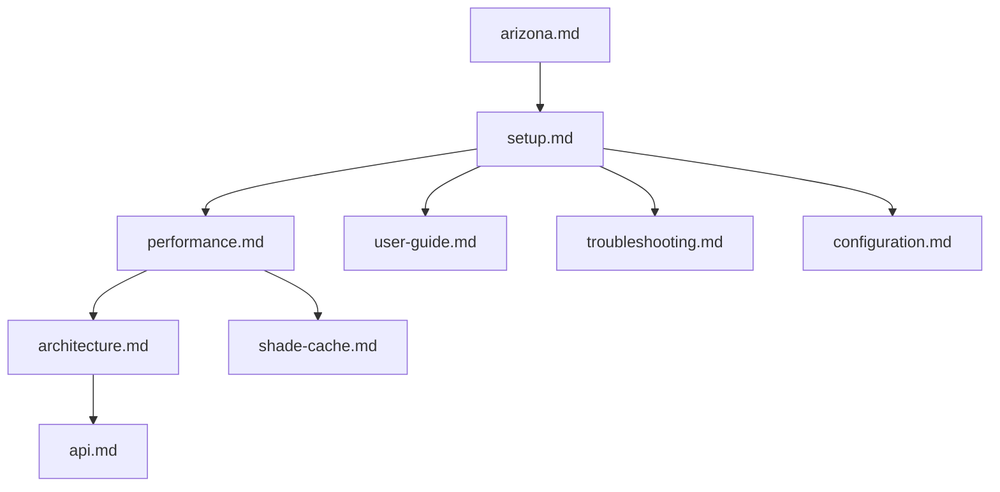

# UmbraStride documentation

Welcome. This folder explains **what UmbraStride is**, **how to install and run it**, **how to make routing fast**, and **how the code works**—for both everyday users and developers.

---

## Start here (pick your path)

| I want to… | Read this |
|------------|-----------|
| **Use the web app** (click map, get routes) | [User guide](user-guide.md) |
| **Install and run** on my computer | [Setup guide](setup.md) |
| **Make routing fast** (caches, warm, disk artifacts) | [**Routing performance**](performance.md) |
| **Fix something broken** | [Troubleshooting](troubleshooting.md) |
| **Understand words** (AOI, alpha, shade cache…) | [Glossary](glossary.md) |
| **Change settings** (.env files) | [Configuration](configuration.md) |
| **Call the HTTP API** | [API reference](api.md) |
| **Learn how the code is organized** | [Architecture](architecture.md) |
| **Work with Arizona / Phoenix data** | [Arizona coverage](arizona.md) |
| **Understand shade storage** | [Shade cache](shade-cache.md) |
| **See how this relates to the research paper** | [Paper mapping](paper-mapping.md) |

---

## What is UmbraStride? (30 seconds)

UmbraStride plans **walking routes that balance shade and distance**. Set **start** and **end** on a map, pick **date and time**, and adjust a slider between **shade** and **shortest walk**.

The app shows up to **three routes**:

| Color | Route | Meaning |
|-------|-------|---------|
| Orange | Shortest | Fewest meters; shade ignored |
| Teal | Coolest | Prefers shady streets |
| Purple | Your route | Your slider preference |

It uses **OpenStreetMap** streets, **cached shade** per time of day, and **shortest-path** routing with custom weights — based on [*Walking in the Shade*](https://doi.org/10.1145/3678717.3691287) (SIGSPATIAL 2024).

---

## What you need before routing works

Routing is **not** global by default. Your machine needs **prepared data** for the area you click:

| Step | Command (Phoenix metro) | Creates |
|------|-------------------------|---------|
| 1. Streets | `python scripts/bootstrap_arizona.py --preset az-phoenix` | `data/graphs/az-phoenix.*` |
| 2. Shade | `python scripts/seed_demo_cache.py --aoi az-phoenix --hours 10,11,12,13,14` | `data/shade-cache/az-phoenix.sqlite` |
| 3. Warm (recommended) | API startup or `POST .../routing/warm` | `data/routing-cache/az-phoenix/` |

Full walkthrough: [Setup guide](setup.md) → [Routing performance](performance.md).

---

## Project layout

```
UmbraStride/
├── apps/web/              ← Browser map (React + MapLibre)
├── services/api/          ← FastAPI backend
├── services/shade-worker/ ← Optional ShadeMap jobs
├── packages/geo-core/     ← OSM graphs, pickle, edge index
├── packages/routing-core/ ← Routing, rustworkx, caches
├── scripts/               ← bootstrap, seed, precompute
├── data/                  ← Graphs, shade, routing cache (you create)
└── docs/                  ← You are here
```

---

## Current features (tanmay branch)

- **No metro dropdown** — AOI from map clicks (widest matching preset).
- **Default metro:** `az-phoenix` (wide Phoenix / Tempe / Scottsdale).
- **Map:** [OpenFreeMap](https://openfreemap.org/) + 3D buildings.
- **Optional:** live shadows with [ShadeMap](https://shademap.app/about/) key.
- **Performance:** pickle graph load, disk routing cache, rustworkx A*, API warm on startup.

---

## Quick links

- [Main README](../README.md)
- [`.env.example`](../.env.example)
- [`apps/web/.env.example`](../apps/web/.env.example)
- [Arizona manifest](../data/regions/arizona.json)

---

## Documentation map


