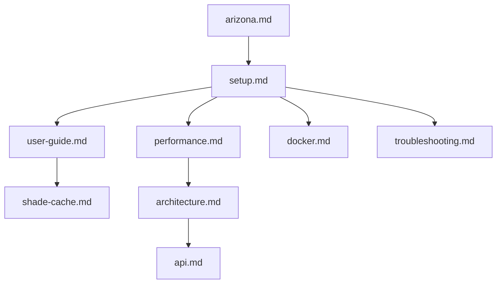

# UmbraStride documentation

Welcome. This folder explains **what UmbraStride is**, **how to install and run it**, **how routing behaves day vs night**, and **how the code works**—for everyday users and developers.

---

## Start here (pick your path)

| I want to… | Read this |
|------------|-----------|
| **Use the web app** (click map, get routes) | [User guide](user-guide.md) |
| **Install and run** on my computer | [Setup guide](setup.md) |
| **Make routing fast** (caches, warm, disk artifacts) | [Routing performance](performance.md) |
| **Fix something broken** | [Troubleshooting](troubleshooting.md) |
| **Understand words** (AOI, alpha, night routing…) | [Glossary](glossary.md) |
| **Change settings** (.env files) | [Configuration](configuration.md) |
| **Call the HTTP API** | [API reference](api.md) |
| **Run with Docker** | [Docker guide](docker.md) |
| **Learn how the code is organized** | [Architecture](architecture.md) |
| **Work with Arizona / Phoenix data** | [Arizona coverage](arizona.md) |
| **Understand shade storage** | [Shade cache](shade-cache.md) |
| **See how this relates to the research paper** | [Paper mapping](paper-mapping.md) |

---

## What is UmbraStride? (30 seconds)

UmbraStride plans **walking routes that balance shade and distance**. Set **start** and **end** on a map, pick **date and time**, and adjust a slider between **shade** and **shortest walk**.

The app shows up to **three routes**:

| Color | Route | Meaning |
|-------|-------|---------|
| Orange | Shortest | Fewest meters; shade ignored |
| Teal | Coolest | Prefers shadier streets |
| Purple | Your route | Your slider preference |

**At night** (sun below the horizon at both points), orange and teal follow the **same path**—there is no sun to avoid, so routing uses uniform full shade.

Based on [*Walking in the Shade*](https://doi.org/10.1145/3678717.3691287) (SIGSPATIAL 2024).

---

## What you need before routing works

| Step | Command (Phoenix metro) | Creates |
|------|-------------------------|---------|
| 1. Streets | `python scripts/bootstrap_arizona.py --preset az-phoenix` | `data/graphs/az-phoenix.*` |
| 2. Shade (day) | `python scripts/seed_demo_cache.py --aoi az-phoenix --hours 10,11,12,13,14` | `data/shade-cache/az-phoenix.sqlite` |
| 2b. Shade (night, optional) | [Pull + seed night hours](setup.md#night-shade-buckets-after-pulling-tanmay) | Night buckets in same SQLite file |
| 3. Warm (recommended) | API startup or `POST .../routing/warm` | `data/routing-cache/az-phoenix/` |

Full walkthrough: [Setup guide](setup.md) → [Routing performance](performance.md).

---

## Day vs night routing (important)

| Condition | Shortest vs coolest |
|-----------|---------------------|
| **Daytime** (sun up at origin and destination) | Usually **different** paths — coolest may detour for shade |
| **Night** (sun down at **both** endpoints) | **Same path** — uniform shade (S = 1) on every street |
| **Dusk** (one point still in daylight) | May still differ — night rule needs both endpoints after sunset |

The web app shows a note when `sun_below_horizon` is true. Details: [Shade cache — weights](shade-cache.md#how-shade-affects-weights).

---

## Project layout

```
UmbraStride/
├── apps/web/              ← Browser map (React + MapLibre)
├── services/api/          ← FastAPI backend
├── services/shade-worker/ ← Batch shade profiling
├── packages/geo-core/     ← OSM graphs, pickle, sun position
├── packages/routing-core/ ← Routing, rustworkx, caches
├── scripts/               ← bootstrap, seed, precompute
├── data/                  ← Graphs, shade, routing cache (you create)
└── docs/                  ← You are here
```

---

## Current features (`tanmay` branch)

- **No metro dropdown** — AOI from map clicks (widest matching preset).
- **Default metro:** `az-phoenix` (Phoenix / Tempe / Scottsdale).
- **Map:** [OpenFreeMap](https://openfreemap.org/) + 3D buildings + local geometric shadows.
- **Performance:** pickle graph load, disk routing cache, rustworkx A*, API warm on startup.
- **Night routing:** uniform full shade when sun is below horizon at both endpoints.
- **Shade worker:** `synthetic` (demo) or `building-aware` (Overpass + SunCalc) via `SHADE_PROFILE_MODE`.
- **Docker:** `docker compose up` — see [Docker guide](docker.md).

---

## Quick links

- [Main README](../README.md)
- [`.env.example`](../.env.example)
- [`apps/web/.env.example`](../apps/web/.env.example)
- [Arizona manifest](../data/regions/arizona.json)

---

## Documentation map


