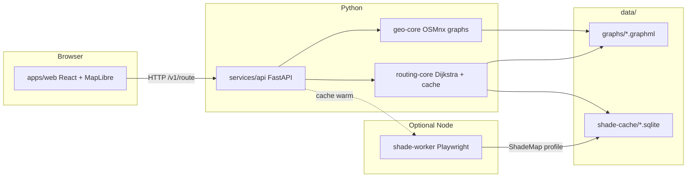

# Architecture

This document explains **how UmbraStride is built** for developers and technical readers. For everyday app usage, see the [User guide](user-guide.md).

---

## System overview



**Request path (Find routes):**

1. Web sends origin, destination, datetime, alpha to `POST /v1/route`.
2. API resolves **AOI** from Arizona presets (widest metro containing both points).
3. API loads **GraphML** + **shade SQLite** for that AOI and time bucket.
4. `routing-core` builds a collapsed directed graph with weights for α ∈ {0, custom, 1}.
5. Three Dijkstra runs (parallel when configured) return paths.
6. API returns GeoJSON geometries + metrics; web draws colored lines.

---

## Monorepo packages

| Package / service | Language | Responsibility |
|-------------------|----------|----------------|
| `packages/geo-core` | Python | Download OSM walk graphs (OSMnx), save GraphML, region manifests, AOI resolution, GeoJSON export |
| `packages/routing-core` | Python | Shade SQLite store, alpha-weighted edge costs, Dijkstra, in-memory caches |
| `packages/shade-engine` | TypeScript | Shared types / keys for shade sampling (used by worker) |
| `services/api` | Python | FastAPI REST surface |
| `services/shade-worker` | TypeScript | Express + Playwright; batch ShadeMap `/profile` (mock or real) |
| `apps/web` | TypeScript | React UI, MapLibre map, OpenFreeMap 3D buildings, ShadeMap overlay |

---

## Data on disk

After bootstrap and seed:

```
data/
├── graphs/
│   ├── az-phoenix.graphml      # Street network
│   ├── az-phoenix.meta.json    # Bbox, node/edge counts
│   └── ...
├── shade-cache/
│   ├── az-phoenix.sqlite       # edge_key → shade_fraction per ts_bucket
│   └── ...
├── regions/
│   └── arizona.json            # Metro presets + state bbox
└── overrides/                  # Optional GeoJSON per AOI (exclude ways)
    └── {aoi_id}.geojson
```

Controlled by `DATA_DIR` (default `./data`).

---

## AOI resolution (automatic)

Implemented in `umbrastride_geo.regions`:

1. Find all metro **presets** whose bbox contains **both** origin and destination.
2. Sort by area **largest first** (prefer `az-phoenix` over `az-phoenix-core` when both match).
3. Return first **bootstrapped** match on the client; API uses same list for routing.
4. If none contain both points, fall back to preset containing origin, then nearest centroid.

The web app mirrors this in `apps/web/src/resolveAoi.ts`.

---

## Routing model

For edge length `L` and shade fraction `S ∈ [0,1]`:

```
L_sun   = L * (1 - S)
L_shade = L * S
weight  = α * L + (1 - α) * (L_sun * β + L_shade)
```

`β` = `SUN_AVERSION_BETA` (default 5).  
Dijkstra minimizes sum of weights along paths.

**Parallel edges** (same two intersections, multiple OSM ways) are collapsed to one directed edge per pair, keeping the **minimum** weight per α.

See [Paper mapping](paper-mapping.md) for research context.

---

## Performance design

| Layer | Strategy |
|-------|----------|
| Graph load | LRU cache per AOI; reload if GraphML mtime changes |
| Shade load | One SQLite query per (AOI, time bucket); nearest-hour fallback if exact bucket missing |
| Routing graph | Vectorized NumPy weight matrix; cached DiGraph per (AOI, bucket, α set) |
| Dijkstra | Local subgraph crop around O/D; parallel ThreadPool per α |
| Bootstrap / seed | Multiprocessing / thread pools; env-tunable worker counts |

Details: [Shade cache](shade-cache.md).

---

## Web map stack

| Layer | Technology |
|-------|------------|
| Basemap | [OpenFreeMap Bright](https://tiles.openfreemap.org/styles/bright) (default) or Mapbox Streets |
| 3D buildings | OpenFreeMap vector `building` layer + `fill-extrusion` ([MapLibre example](https://maplibre.org/maplibre-gl-js/docs/examples/display-buildings-in-3d/)) |
| Live shadows | `mapbox-gl-shadow-simulator` + `getFeatures` from same building source |
| Routes / markers | GeoJSON sources added in `MapView.tsx` |

---

## Shade pipeline modes

| Mode | Command | Shade quality | Needs ShadeMap key |
|------|---------|---------------|-------------------|
| Demo / synthetic | `seed_demo_cache.py` | Approximate (bearing vs sun) | No |
| Precompute | `precompute_shade.py` + worker | Intended real profiles | Yes (worker) |
| Cache warm | `POST .../cache/warm` | Sample ping only | Worker running |

---

## API surface

Full list: [API reference](api.md).

---

## Extension points

- **New region:** Add `data/regions/{id}.json`, presets, bootstrap script invocation.
- **Street overrides:** `data/overrides/{aoi_id}.geojson` with `exclude_way` actions.
- **Custom β or weight function:** `umbrastride_routing/weights.py` + rebuild graph cache.
- **Production deploy:** Run API behind reverse proxy; build web with `npm run build -w @umbrastride/web`; set `VITE_API_URL`.

---

## What is not implemented (v1)

- Playwright ShadeMap integration fully production-hardened in worker (mock path exists).
- Docker images referenced in compose but not shipped in all branches.
- Globe / terrain / full-state single-graph routing.
- Mobile native apps.

---

## See also

- [Glossary](glossary.md)
- [Configuration](configuration.md)
- [Arizona coverage](arizona.md)
