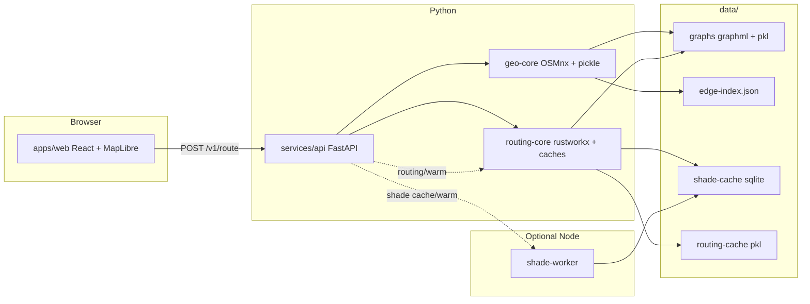

# Architecture

How UmbraStride is built — for developers and technical readers. For map usage, see the [User guide](user-guide.md).

---

## System overview



---

## Request path (Find routes)

1. Web sends origin, destination, datetime, α → `POST /v1/route`.
2. API resolves **AOI** from Arizona presets (widest metro containing both points).
3. **Load street graph** — prefer `graph.pkl` over GraphML; ensure `edge-index.json`.
4. **Load shade** — one SQLite query → dense `float32` array indexed by edge key order.
5. **Get routing DiGraph** — from disk cache (`routing-cache/*.routing.pkl`) or build with NumPy weights (no geometry on edges).
6. **Corridor crop** around origin/destination; expand margin scales until path exists.
7. **Three shortest paths** (rustworkx A* or Dijkstra) for α ∈ {1.0, 0.0, custom}.
8. **Resolve geometry** on path edges only via walk graph `edge_key` lookup.
9. Return GeoJSON + metrics; web draws colored lines.

Startup (when `ROUTING_WARM_ON_STARTUP=1`): same load/build path for `DEFAULT_AOI_ID` before first HTTP request.

When automatic local shade is enabled, the route path also ensures the requested 15-minute shade bucket exists before loading shade. Shade-cache SQLite files use WAL mode and a busy timeout, and synthetic shade generation is serialized per AOI/time bucket so overlapping `/route` and `/shade/sync` requests do not try to seed the same bucket at once.

---

## Monorepo packages

| Package / service | Language | Responsibility |
|-------------------|----------|----------------|
| `packages/geo-core` | Python | OSM download (OSMnx), GraphML + pickle, edge index, AOI resolution |
| `packages/routing-core` | Python | Shade SQLite, NumPy graph build, disk cache, rustworkx pathfind, LRU caches |
| `packages/shade-engine` | TypeScript | Shared types for shade worker |
| `services/api` | Python | FastAPI REST, startup warm, routing warm endpoint |
| `services/shade-worker` | TypeScript | Batch `/profile` (synthetic or building-aware via Overpass) |
| `apps/web` | TypeScript | React, MapLibre, OpenFreeMap 3D, local shadow overlay |

---

## Data on disk

```
data/
├── graphs/
│   ├── az-phoenix.graphml          # Source street network (OSMnx)
│   ├── az-phoenix.graph.pkl        # Fast pickle reload
│   ├── az-phoenix.edge-index.json  # edge_key list → dense index
│   ├── az-phoenix.meta.json        # Bbox, counts
│   └── ...
├── shade-cache/
│   ├── az-phoenix.sqlite           # shade_fraction per (edge_key, ts_bucket)
│   └── ...
├── routing-cache/
│   ├── az-phoenix/
│   │   └── {hash}.routing.pkl      # Cached weighted DiGraph per bucket + α set
│   └── ...
├── regions/
│   └── arizona.json
└── overrides/
    └── {aoi_id}.geojson            # Optional exclude_way
```

Controlled by `DATA_DIR` (default `./data`).

---

## AOI resolution (automatic)

In `umbrastride_geo.regions`:

1. Presets whose bbox contains **both** origin and destination.
2. Sort by area **largest first** (`az-phoenix` over `az-phoenix-core`).
3. Prefer bootstrapped graph on disk.
4. Fallback: origin preset, then nearest centroid.

Web mirror: `apps/web/src/resolveAoi.ts`.

---

## Routing model

For edge length `L`, shade `S ∈ [0,1]`, preference `α`, shade curve `γ` (default 3), sun penalty `β` (default 5), and shaded-distance tie-break `ε` (default 0.001):

```
L_sun   = L * (1 - S)
L_shade = L * S
b       = (1 - α) ^ γ
weight  = (1 - b) * L + b * (L_sun * β + L_shade * ε)
```

Dijkstra / A* minimizes sum of weights.

At `α = 0`, the route minimizes sun exposure first; shaded distance only acts as a tiny tie-breaker. At `α = 1`, the route is pure shortest distance. The curve keeps middle slider values from saturating into the same path as 100% shade bias.

**Night (sun below horizon at both endpoints):** `umbrastride_geo.sun.is_route_at_night()` forces shade fraction **S = 1** on every edge before building weights. Coolest and shortest then both minimize distance only. Response includes `sun_below_horizon: true`. Seed and shade-worker synthetic modes apply the same rule when profiling at night.

**Parallel edges** collapse to one directed edge per `(u,v)` with minimum weight per α; **route_payloads** keep α-specific metrics for geometry/metrics on the winning parallel edge.

See [Paper mapping](paper-mapping.md).

---

## Performance design

| Stage | Strategy |
|-------|----------|
| Graph load | Pickle preferred over GraphML; LRU in RAM |
| Shade load | Single SQL query → `float32[]` via edge index |
| Graph build | Vectorized NumPy; geometry omitted from routing graph |
| Routing graph | Disk pickle keyed by graph mtime + shade mtime + α set |
| Path search | Adaptive corridor crop + rustworkx A* (or Dijkstra) |
| Parallelism | ThreadPool for 3 α paths; NumPy/BLAS for weights |
| Warm | API startup + `POST /v1/aoi/{id}/routing/warm` |

Full walkthrough: [Routing performance](performance.md).

---

## Web map stack

| Layer | Technology |
|-------|------------|
| Basemap | [OpenFreeMap Bright](https://tiles.openfreemap.org/styles/bright) or Mapbox |
| 3D buildings | OpenFreeMap `building` + MapLibre fill-extrusion |
| Live shadows | SunCalc + local building shadow projection |
| Routes | GeoJSON in `MapView.tsx` |

---

## Shade pipeline modes

| Mode | Command | Quality | External data |
|------|---------|---------|---------------|
| Demo synthetic | `seed_demo_cache.py` | Approximate | No |
| Precompute | `precompute_shade.py` + worker | Building-aware profiles | Overpass when enabled |
| Shade warm | `POST .../cache/warm` | Sample ping | Worker |
| Routing warm | `POST .../routing/warm` | N/A (preload only) | No |

---

## API surface

[API reference](api.md) — includes `POST /v1/aoi/{aoi_id}/routing/warm`.

---

## Extension points

- New region: `data/regions/{id}.json` + bootstrap.
- Street overrides: `data/overrides/{aoi_id}.geojson`.
- Weight function: `umbrastride_routing/weights.py` + invalidate routing cache.
- Path engine: `ROUTING_PATH_ENGINE=networkx` for debugging.
- Production: reverse proxy, `npm run build`, set `VITE_API_URL`.

---

## Deployment

Dockerfiles and [Docker guide](docker.md) for API, web (nginx), and shade-worker.

## Future work

- Higher-fidelity batch shadow simulation for dense downtown scenes.
- Single statewide graph (use metro presets or tiles instead).
- Native mobile apps.

---

## See also

- [Routing performance](performance.md)
- [Shade cache](shade-cache.md)
- [Configuration](configuration.md)
- [Glossary](glossary.md)
