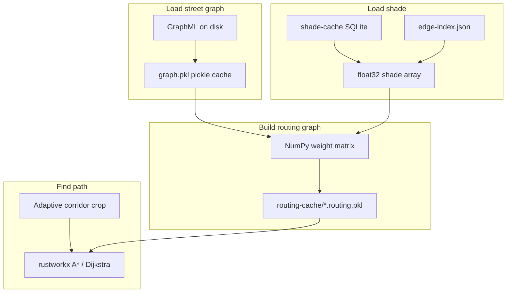

# Routing performance

This guide explains **how UmbraStride makes routing fast**, what files are created automatically, and **exact steps** to warm caches before demoing or deploying.

For install steps, see [Setup](setup.md). For every env variable, see [Configuration](configuration.md).

---

## The problem (why the first route felt slow)

On a large metro like **`az-phoenix`** (~560k street edges), each route request used to pay:

1. **Parse GraphML** (XML) from disk  
2. **Load shade** from SQLite into memory  
3. **Build a weighted routing graph** in Python (collapse parallel edges, compute α weights)  
4. **Run shortest-path** three times (shortest, coolest, your α)  
5. **Attach geometry** to the returned path  

Steps 1–3 dominated **cold** requests (10–20+ seconds). Repeat clicks were faster only because everything stayed in RAM until the API restarted.

The performance stack below attacks each bottleneck.

---

## Performance stack (what we implemented)



| Layer | What it does | On-disk artifact |
|-------|----------------|------------------|
| **Pickle graph load** | Reload street graph without XML parse | `data/graphs/{aoi}.graph.pkl` |
| **Edge index** | Map `edge_key` → dense integer for vectorized shade | `data/graphs/{aoi}.edge-index.json` |
| **Shade array** | One SQL query → `float32[]` (not per-edge dict during build) | (in memory; SQLite unchanged) |
| **Routing disk cache** | Skip rebuild of weighted DiGraph | `data/routing-cache/{aoi}/*.routing.pkl` |
| **Geometry on demand** | Routing graph stores weights only; geometry resolved for path edges | — |
| **Corridor crop** | Search a corridor around O→D; expand margin until path exists | — |
| **rustworkx + A\*** | Fast shortest-path in Rust | — |
| **Startup / API warm** | Preload before first user click | — |

---

## Cache tiers (mental model)

| Tier | Location | Invalidates when |
|------|----------|------------------|
| **L0** | API process RAM | API restart |
| **L1** | Pickle + routing-cache on disk | GraphML or shade SQLite mtime changes |
| **L2** | GraphML + shade SQLite | You re-bootstrap or re-seed |
| **L3** | OSM / ShadeMap source | External data refresh |

**In-memory (L0)** — LRU caches in `packages/routing-core/src/umbrastride_routing/cache.py`:

- Street graph (MultiDiGraph)  
- Edge index  
- Shade array per `(aoi, ts_bucket)`  
- Routing DiGraph per `(aoi, bucket, α set)`  

**On-disk (L1)** — survives API restart; rebuilt when source files change.

### Night routing and cache keys

When the sun is below the horizon at **both** endpoints, shade is forced to **uniform full shade** (S = 1) before weights are built. Coolest and shortest then share the same path. The API sets `sun_below_horizon: true` and uses a separate routing-cache key (`uniform_full_shade`) so day and night buckets do not collide. Warm night hours separately if you demo after dark:

```bash
python scripts/seed_demo_cache.py --aoi az-phoenix --hours 20,21,22,23,0,1,2,3,4,5
curl -X POST http://127.0.0.1:8000/v1/aoi/az-phoenix/routing/warm \
  -H "Content-Type: application/json" \
  -d '{"hours": [20, 21, 22, 23, 0, 1, 2, 3, 4, 5]}'
```

Details: [Shade cache — weights](shade-cache.md#how-shade-affects-weights).

---

## Step-by-step: full performance setup (Phoenix metro)

Run from repo root with venv active (`source .venv/bin/activate`).

### Step 1 — Install dependencies (includes rustworkx)

```bash
python3 -m venv .venv
source .venv/bin/activate
pip install -e "packages/geo-core[dev]" -e "packages/routing-core[dev]" -e "services/api[dev]"
npm install
```

`routing-core` depends on **rustworkx** for shortest-path. If import fails, run `pip install rustworkx`.

### Step 2 — Configure `.env` for warm + disk cache

Copy and edit:

```bash
cp .env.example .env
cp apps/web/.env.example apps/web/.env
```

Recommended performance block in **`.env`**:

```env
DATA_DIR=./data
DEFAULT_AOI_ID=az-phoenix

# Performance (defaults in .env.example)
ROUTING_DISK_CACHE=1
ROUTING_WARM_ON_STARTUP=1
ROUTING_WARM_HOURS=10,11,12,13,14
ROUTING_PATH_ENGINE=rustworkx
ROUTING_USE_ASTAR=1
ROUTING_LOCAL_MARGIN_DEG=0.012
ROUTING_CORRIDOR_SCALES=0.6,1.0,1.6,3.0
```

| Variable | Effect |
|----------|--------|
| `ROUTING_WARM_ON_STARTUP=1` | API preloads graph + routing cache on boot |
| `ROUTING_WARM_HOURS` | Extra UTC hours to warm at startup (match your seed hours) |
| `ROUTING_DISK_CACHE=1` | Write/read `data/routing-cache/` |
| `ROUTING_PATH_ENGINE=rustworkx` | Use rustworkx (set `networkx` to debug) |

### Step 3 — Bootstrap streets

```bash
python scripts/bootstrap_arizona.py --preset az-phoenix
```

Creates:

- `data/graphs/az-phoenix.graphml`  
- `data/graphs/az-phoenix.meta.json`  
- `data/graphs/az-phoenix.graph.pkl` (pickle, at bootstrap)  
- `data/graphs/az-phoenix.edge-index.json` (edge index, at bootstrap)  

**If you already had GraphML from an older install:** first load or warm will create pickle + edge index automatically.

### Step 4 — Seed shade

```bash
python scripts/seed_demo_cache.py --aoi az-phoenix --hours 10,11,12,13,14 --date 2026-05-22
```

Creates `data/shade-cache/az-phoenix.sqlite`. Use the **same date** in the web datetime picker (or accept nearest-hour fallback).

### Step 5 — Start API (triggers startup warm)

```bash
uvicorn umbrastride_api.main:app --reload --host 127.0.0.1 --port 8000
```

On startup the API calls `warm_routing_cache(DEFAULT_AOI_ID)` when `ROUTING_WARM_ON_STARTUP=1`.  
**First startup after seed may still take minutes** while routing `.pkl` files are built; later startups load from disk.

Watch for no errors in the terminal. Test health:

```bash
curl http://127.0.0.1:8000/health
```

### Step 6 — Optional manual warm (before a demo)

Warm specific hours without waiting for a route click:

```bash
curl -s -X POST http://127.0.0.1:8000/v1/aoi/az-phoenix/routing/warm \
  -H "Content-Type: application/json" \
  -d '{"hours": [10, 11, 12, 13, 14], "alphas": [1.0, 0.0, 0.5]}'
```

Response:

```json
{
  "status": "warmed",
  "aoi_id": "az-phoenix",
  "warmed_buckets": ["2026-05-22T12:00", "..."],
  "alphas": [1.0, 0.0, 0.5]
}
```

### Step 7 — Start web and test

```bash
npm run dev:web
```

Open http://localhost:5173, place origin/destination, set datetime to a **seeded hour**, click **Find routes**.

**Expected behavior:**

| Scenario | Typical latency (hardware-dependent) |
|----------|--------------------------------------|
| First ever warm for `(aoi, hour)` | Minutes (build + write disk cache) |
| API restart, cache on disk | Seconds to load pickle + routing pkl |
| Same API process, repeat clicks | Often sub-second |

### Step 8 — Verify artifacts on disk

```bash
ls -la data/graphs/az-phoenix.*
ls -la data/routing-cache/az-phoenix/
ls -la data/shade-cache/az-phoenix.sqlite
```

You should see:

```
data/graphs/az-phoenix.graphml
data/graphs/az-phoenix.graph.pkl
data/graphs/az-phoenix.edge-index.json
data/graphs/az-phoenix.meta.json
data/shade-cache/az-phoenix.sqlite
data/routing-cache/az-phoenix/*.routing.pkl   # after warm or first route
```

---

## When caches invalidate

| You changed… | Action |
|--------------|--------|
| Re-ran `bootstrap_aoi` / bootstrap script | GraphML mtime changes → pickle, edge index, routing cache rebuild |
| Re-ran `seed_demo_cache` / precompute | SQLite mtime changes → shade array + routing cache rebuild |
| Routing code or `SUN_AVERSION_BETA` | Delete `data/routing-cache/{aoi}/` or touch shade/graph to force rebuild |
| Only restarted API | Disk cache reused; startup warm reloads into RAM |

Clear in-process caches without restart (Python REPL / tests):

```python
from umbrastride_routing import clear_caches
clear_caches()
```

---

## Fast dev preset vs wide metro

| AOI | Edges (order of magnitude) | Use when |
|-----|----------------------------|----------|
| `az-phoenix-core` | ~140k | Laptop dev, CI, quick iteration |
| `az-phoenix` | ~560k | Realistic metro demo |

Same performance features apply to both; wide metro just has larger files and longer first warm.

---

## Troubleshooting performance

| Symptom | Likely cause | Fix |
|---------|--------------|-----|
| Every click slow | API reload in `--reload` dev mode restarting process | Normal in dev; production without reload keeps RAM |
| First click slow after seed | Routing disk cache not built yet | Run `POST .../routing/warm` or wait for startup warm |
| `ImportError: rustworkx` | Dependency missing | `pip install rustworkx` |
| Routes wrong with A* enabled | Rare heuristic edge case on bad test data | Set `ROUTING_USE_ASTAR=0` or `ROUTING_PATH_ENGINE=networkx` |
| Disk filling up | Many AOIs × many hours × routing pkl | Delete `data/routing-cache/`; keep GraphML + SQLite |

More: [Troubleshooting — slow routes](troubleshooting.md#routes-very-slow-first-time-then-ok).

---

## Code map (developers)

| Module | Role |
|--------|------|
| `packages/geo-core/.../graph.py` | GraphML + pickle load/save |
| `packages/geo-core/.../edge_index.py` | Edge key ↔ index |
| `packages/routing-core/.../shade_store.py` | SQLite + `resolve_bucket_array` |
| `packages/routing-core/.../graph_build.py` | NumPy weights, no geometry on edges |
| `packages/routing-core/.../disk_cache.py` | Routing DiGraph pickle |
| `packages/routing-core/.../cache.py` | LRU + `warm_routing_cache` |
| `packages/routing-core/.../pathfind.py` | rustworkx, corridor crop, A* |
| `services/api/.../main.py` | Startup lifespan warm, `POST .../routing/warm` |

---

## See also

- [Setup guide](setup.md) — full install walkthrough  
- [Shade cache](shade-cache.md) — shade data + cache interaction  
- [Architecture](architecture.md) — system design  
- [API — routing warm](api.md#post-v1aoiaoi_idroutingwarm)  
- [Configuration](configuration.md) — all env vars  
