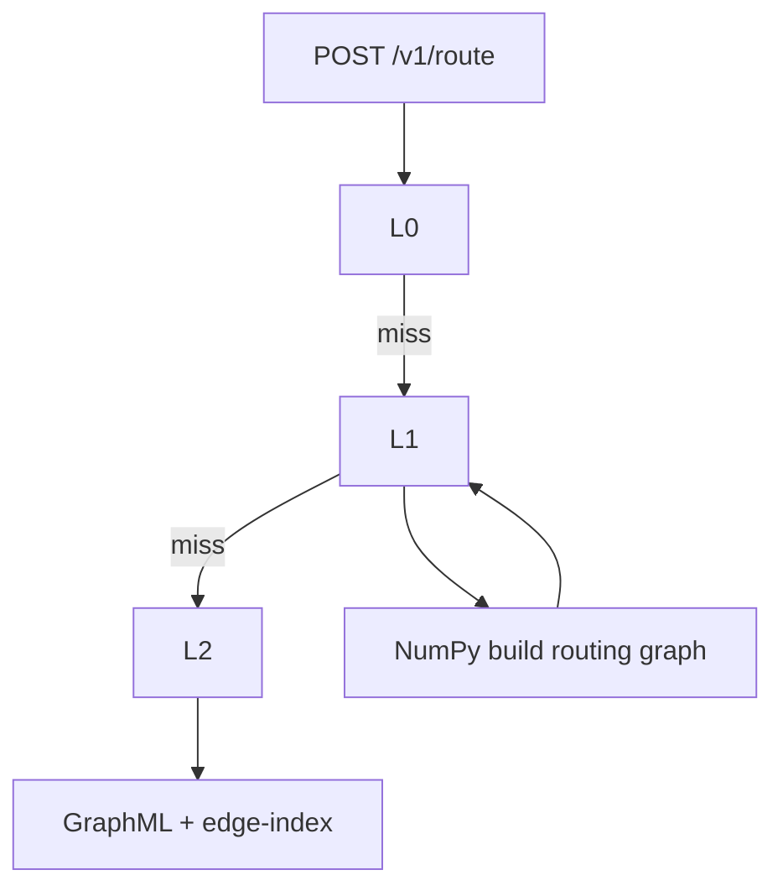

# Shade cache

How UmbraStride stores **shade along streets**, how that affects **routing**, and how to **fill, refresh, and warm** caches.

**Performance-focused setup:** [Routing performance](performance.md)  
**Install steps:** [Setup guide](setup.md)

---

## Plain-language summary

For each **street segment** and **time of day**, UmbraStride stores a number **0–1**:

- **0** — mostly in the sun  
- **1** — mostly in shade  

**Coolest** routes penalize sunny segments. **Shortest** routes ignore shade.

Data lives in **SQLite per AOI**. If missing, every street defaults to **50% shade** and all three routes look the same.

SQLite is also the coordination point for automatic shade generation. Route requests can create the selected 15-minute bucket before routing; background shade sync and manual precompute write to the same `{aoi_id}.sqlite` file.

---

## Cache tiers (full stack)

| Tier | Storage | Contents | Speed |
|------|---------|----------|-------|
| **L0 RAM** | API process | Pickle graph, shade array, routing DiGraph | Fastest |
| **L1 disk** | `routing-cache/*.routing.pkl`, `graph.pkl` | Pre-built routing graphs, fast graph reload | Fast after first build |
| **L2 disk** | `shade-cache/*.sqlite` | Shade fractions per edge × hour | One query per bucket |
| **L3 source** | GraphML | Raw OSM street network | Slowest parse |



---

## Keys and time buckets

| Field | Format | Example |
|-------|--------|---------|
| `aoi_id` | Metro id | `az-phoenix` |
| `edge_key` | Segment id | `41190548\|7093578437\|0` |
| `ts_bucket` | UTC, 15-min floor | `2026-06-01T12:00` |

**Edge index:** `data/graphs/{aoi}.edge-index.json` maps each `edge_key` to a dense index so shade loads as a **NumPy array** (fast graph build).

### Bucket sync and nearest-hour fallback

When automatic local shade is enabled, route requests sync the selected time bucket before computing routes. The API also refreshes the active bucket in the background about every 10 minutes.

If automatic shade is disabled or a bucket cannot be generated, the router can fall back:

1. API uses **nearest cached hour**.
2. Response: `shade_cache_exact: false`, `shade_ts_bucket` = actual bucket.
3. Web may show a yellow sidebar hint.

**Fix:** Seed the hours you test:

```bash
# 5 AM-7 PM UTC
python scripts/seed_demo_cache.py --aoi az-phoenix --hours 5,6,7,8,9,10,11,12,13,14,15,16,17,18,19
# 5 AM-7 PM Phoenix local (MST / UTC-7)
python scripts/seed_demo_cache.py --aoi az-phoenix --hours 12,13,14,15,16,17,18,19,20,21,22,23,0,1,2
```

### SQLite concurrency

Shade cache writes are safe for normal local use, but SQLite allows only one writer at a time. UmbraStride configures shade-cache connections with:

- `PRAGMA journal_mode = WAL`
- `PRAGMA busy_timeout = 30000`
- one in-process synthetic seed lock per AOI/time bucket

This prevents most `database is locked` failures when `/v1/route` and `/v1/aoi/{aoi}/shade/sync` touch the same bucket. If you run an external script such as `precompute_shade.py` while routing in the web app, the API may wait for that writer to finish. For long precompute jobs, avoid routing the same AOI until the script completes.

---

## How shade is computed

### Demo (synthetic — no ShadeMap)

`scripts/seed_demo_cache.py` — fake shade from time + street bearing vs sun.

```bash
# 5 AM-7 PM UTC
python scripts/seed_demo_cache.py --aoi az-phoenix --hours 5,6,7,8,9,10,11,12,13,14,15,16,17,18,19
# 5 AM-7 PM Phoenix local (MST / UTC-7)
python scripts/seed_demo_cache.py --aoi az-phoenix --hours 12,13,14,15,16,17,18,19,20,21,22,23,0,1,2
```

**Night hours** (optional — same script; uses **astral** for sun position; uniform full shade when sun is below horizon):

```bash
git pull origin main
source .venv/bin/activate
pip install -e packages/geo-core   # pulls in astral
python scripts/seed_demo_cache.py --aoi az-phoenix --hours 20,21,22,23,0,1,2,3,4,5
```

See [Setup — Night shade buckets](setup.md#night-shade-buckets).

Parallel: `SHADE_SEED_WORKERS=0` uses all cores.

### Batch precompute (shade worker)

1. Sample points along each edge geometry.  
2. Worker `/profile` at datetime `t`.  
3. `SHADE_PROFILE_MODE=building-aware` uses Overpass + SunCalc. `synthetic` matches the seed script.
4. `shade_fraction = shaded_points / N` → SQLite via `precompute_shade.py`.

```bash
npm run dev:worker
python scripts/precompute_shade.py --aoi az-phoenix --hours 12,13,14,15,16,17,18,19,20,21,22,23,0,1,2
```

---

## SQLite schema

Path: `{DATA_DIR}/shade-cache/{aoi_id}.sqlite`

```sql
CREATE TABLE edge_shade (
  aoi_id TEXT NOT NULL,
  edge_key TEXT NOT NULL,
  ts_bucket TEXT NOT NULL,
  shade_fraction REAL NOT NULL,
  sample_count INTEGER NOT NULL DEFAULT 1,
  PRIMARY KEY (aoi_id, edge_key, ts_bucket)
);
```

Inspect:

```bash
python3 -c "
from umbrastride_routing.shade_store import ShadeStore
s = ShadeStore('az-phoenix')
print(s.coverage())
print('buckets', s.list_buckets()[:8])
"
```

---

## How shade affects weights

```
L_sun   = L * (1 - S)
L_shade = L * S
b       = (1 - α) ^ γ
weight  = (1 - b) * L + b * (L_sun * β + L_shade * ε)
```

- **α = 1** → shortest (distance only)  
- **α = 0** → most shaded; shaded distance is only a tiny tie-breaker
- **Slider** → curved blend, so midpoints stay meaningfully between shortest and most-shaded

Code: `packages/routing-core/src/umbrastride_routing/weights.py`  
Defaults: **β = 5** (`SUN_AVERSION_BETA`), **ε = 0.001** (`SHADE_DISTANCE_TIEBREAK`), **γ = 3** (`SHADE_BIAS_CURVE`).

When the **sun is below the horizon** at both origin and destination, routing uses **uniform full shade** (S = 1). Coolest and shortest then share the **same path**.

Each request: paths for **α ∈ {1.0, 0.0, your α}** in parallel when `ROUTING_DIJKSTRA_WORKERS` > 0.

---

## Routing performance (detailed)

### What happens on `POST /v1/route`

| Step | Work | Optimized by |
|------|------|--------------|
| 1 | Load walk graph | `graph.pkl` + LRU |
| 2 | Load shade bucket | One SQL → `float32[]` + edge index |
| 3 | Build/get routing DiGraph | Disk `routing-cache/*.routing.pkl` |
| 4 | Crop corridor subgraph | `ROUTING_CORRIDOR_SCALES` |
| 5 | 3× shortest path | rustworkx A* + ThreadPool |
| 6 | Path geometry | Lookup only on path edges |

### Typical timings (hardware-dependent)

| AOI | Cold (no disk routing cache) | Warm (RAM or routing pkl) |
|-----|------------------------------|---------------------------|
| `az-phoenix-core` | ~5–15 s | often &lt; 1 s |
| `az-phoenix` | ~1–5 min first build | ~1–5 s load |

**Note:** `--reload` in dev restarts the API and clears L0 RAM.

### Warm before demo

**Automatic:** `ROUTING_WARM_ON_STARTUP=1` + `ROUTING_WARM_HOURS=12,13,14,15,16,17,18,19,20,21,22,23,0,1,2` for 5 AM-7 PM Phoenix local, or `5,6,7,8,9,10,11,12,13,14,15,16,17,18,19` for UTC.

**Manual:**

```bash
curl -X POST http://127.0.0.1:8000/v1/aoi/az-phoenix/routing/warm \
  -H "Content-Type: application/json" \
  -d '{"hours": [12, 13, 14, 15, 16, 17, 18, 19, 20, 21, 22, 23, 0, 1, 2]}'
```

See [Routing performance](performance.md) for full steps.

---

## Environment variables

| Variable | Default | Purpose |
|----------|---------|---------|
| `SUN_AVERSION_BETA` | `5.0` | Sun penalty |
| `SHADE_BIAS_CURVE` | `3.0` | Curves the slider so 50% shade bias does not behave like 100% shade bias |
| `ROUTING_DISK_CACHE` | `1` | Persist routing DiGraph |
| `ROUTING_WARM_ON_STARTUP` | `1` | Warm on API boot |
| `ROUTING_WARM_HOURS` | empty | Extra UTC hours at startup |
| `ROUTING_PATH_ENGINE` | `rustworkx` | Path library |
| `ROUTING_USE_ASTAR` | `1` | A* heuristic |
| `ROUTING_LOCAL_MARGIN_DEG` | `0.012` | Corridor margin |
| `ROUTING_CORRIDOR_SCALES` | `0.6,1.0,1.6,3.0` | Expand until path found |
| `SHADE_SEED_WORKERS` | all cores | Parallel seed |
| `PRECOMPUTE_WORKERS` | all cores | Parallel precompute |

Full table: [Configuration](configuration.md).

---

## API endpoints

### Shade coverage

```http
GET /v1/aoi/az-phoenix/cache/coverage
GET /v1/aoi/az-phoenix/cache/coverage?ts_bucket=2026-06-01T12:00
```

### Shade warm (worker sample)

```http
POST /v1/aoi/az-phoenix/cache/warm
Content-Type: application/json

{"datetime": "2026-06-01T12:00:00Z", "persist_sample": false}
```

Up to 200 sample points. Set `"persist_sample": true` to write those edges into SQLite (partial bucket).

### Routing warm (preload graph + routing cache)

```http
POST /v1/aoi/az-phoenix/routing/warm
Content-Type: application/json

{"hours": [12, 13, 14, 15, 16, 17, 18, 19, 20, 21, 22, 23, 0, 1, 2], "alphas": [1.0, 0.0, 0.5]}
```

Does **not** fetch ShadeMap — only loads/builds routing artifacts.

Details: [API reference](api.md).

---

## Checklist: routing looks wrong

- [ ] `data/shade-cache/{aoi}.sqlite` exists  
- [ ] Seeded for AOI + datetime hour  
- [ ] API restarted after seed  
- [ ] Sidebar not stuck on empty nearest-hour fallback  
- [ ] Shortest (orange) ≠ coolest (teal) on map  
- [ ] `data/routing-cache/{aoi}/` populated after warm  

---

## See also

- [Routing performance](performance.md)
- [Troubleshooting](troubleshooting.md)
- [Architecture](architecture.md)
